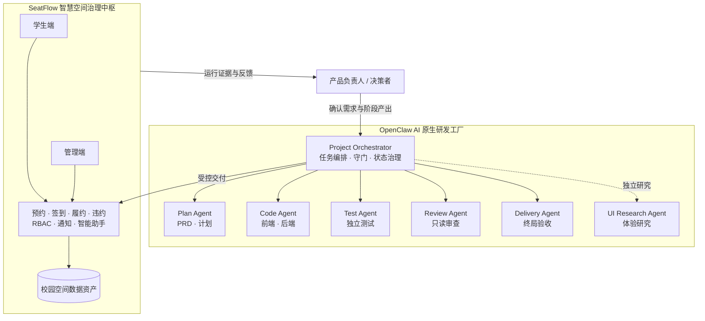
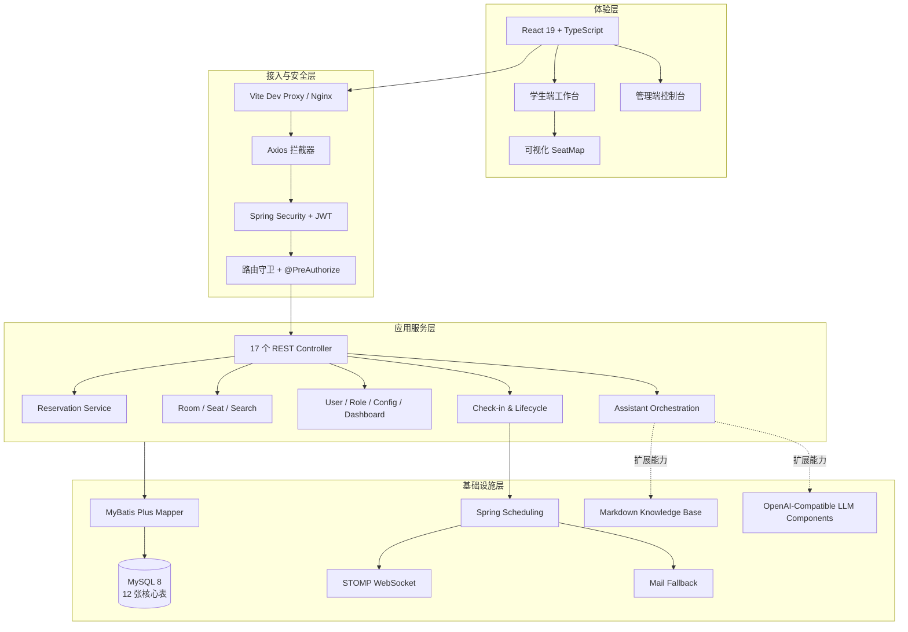
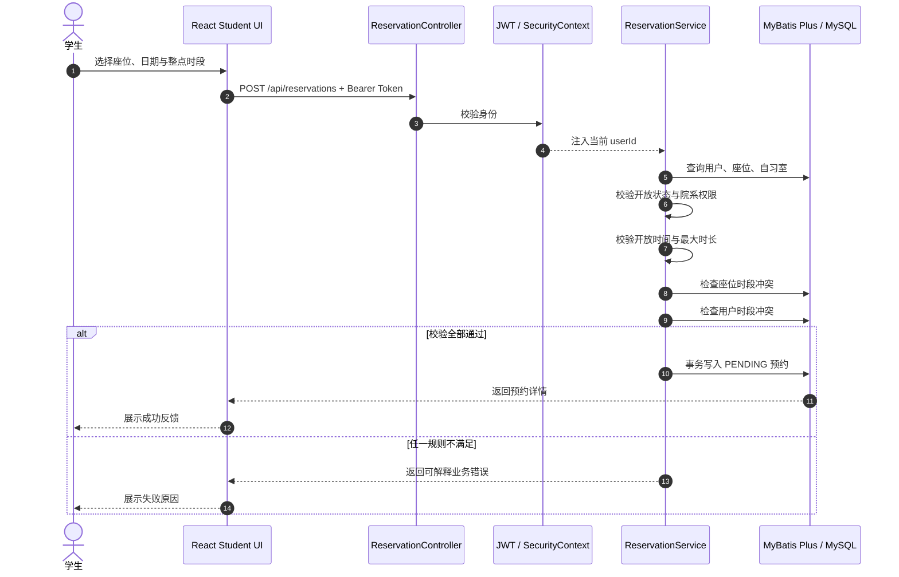
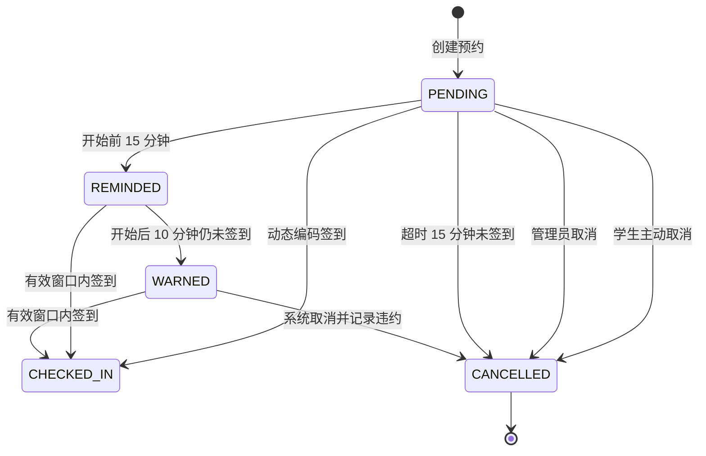
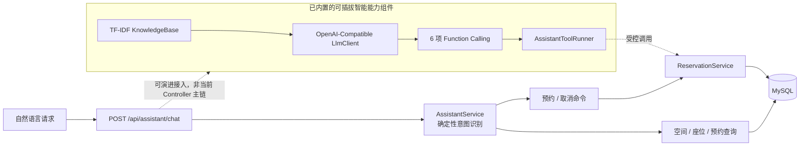
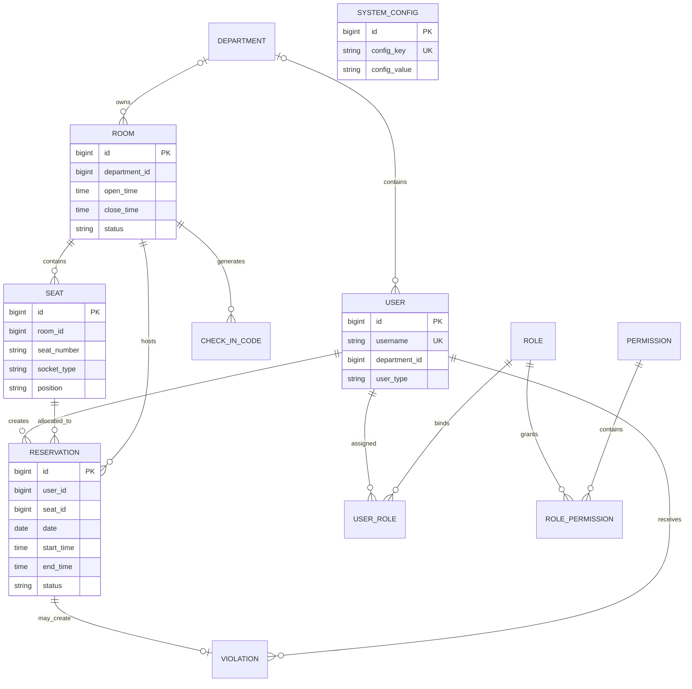
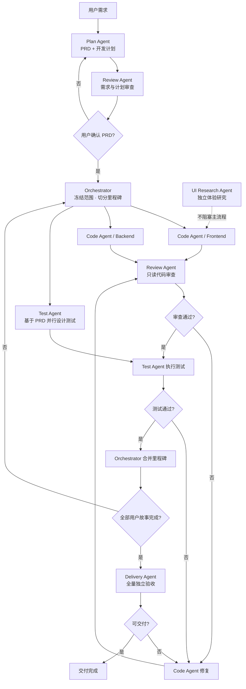
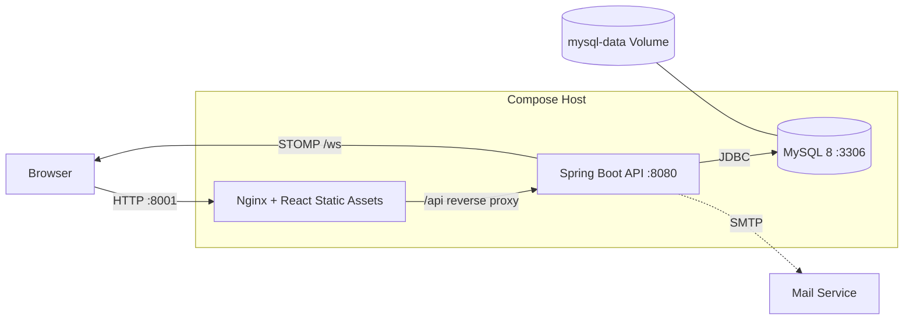

<div align="center">

# 🪑 SeatFlow

### AI-Native Campus Space Operating System

**面向高校智慧空间治理的全链路座位资源编排中枢**<br />
将每一张座位升级为可计算、可调度、可追踪、可治理的数字化时空资产。

<p>
  
  
  
  
  
  
</p>

[核心能力](#-核心能力) · [系统架构](#-系统架构) · [多-agent-分工](#-多-agent-研发编排与分工) · [快速开始](#-快速开始) · [源码地图](#-源码地图)

</div>

---

## 🌌 项目愿景

SeatFlow 不是一个简单的“预约表单”，而是一套面向高校空间资产的 **数字化治理操作系统**：它将自习室、座位、时间、身份、权限与履约行为统一建模，让资源发现、精准预约、动态签到、实时提醒、违约治理、运营分析与智能交互在同一条数据链路中闭环。

更重要的是，SeatFlow 不只交付业务系统，还把软件生产过程本身升级为一座 **AI 原生交付工厂**。仓库通过 `1 个 Orchestrator + 6 个专业 Agent` 完成需求规划、并行编码、独立测试、代码审查、交付验收与 UI 研究，让“研发分工、质量守门、证据沉淀”成为项目架构的一部分。

| 体系规模 | 源码落点 |
|---|---|
| 17 条端到端用户故事 | 学生端 US-S01～S11 + 管理端 US-A01～A06 |
| 12 张核心数据表 | 用户、空间、预约、签到、违约、RBAC、系统参数 |
| 8 项细粒度权限 | 资源、预约、违约、用户、角色、系统配置 |
| 6 项智能工具定义 | 查询空间、搜索座位、查预约、预约、取消、查违约 |
| 1 + 6 Agent 研发矩阵 | Orchestrator + Plan / Code / Review / Test / Delivery / UI Research |

### 一分钟理解：校园空间的“空中交通管制系统”

| SeatFlow 组件 | 管制系统类比 | 实际作用 |
|---|---|---|
| 自习室与座位 | 机场与停机位 | 把物理空间转化为可检索、可分配的数字资源 |
| 预约时段 | 航班时刻槽 | 通过时间区间冲突检测保证资源不被重复占用 |
| 动态签到码 | 登机口核验 | 确认预约者按时到场，让“预订”转化为“真实使用” |
| 定时任务与通知 | 塔台调度 | 在关键时间点提醒、催促、取消并释放资源 |
| JWT + RBAC | 空侧通行权限 | 让学生、运营人员与系统管理员各司其职 |
| 智能助手 | 智能调度员 | 把自然语言意图映射为查询与受控业务操作 |

## 🧭 双核全景

SeatFlow 由“运行时业务中枢”与“研发时智能工厂”两大引擎共同构成：



## ✨ 核心能力

### 学生端：从“找座”到“履约”的一站式体验

- **空间发现**：查看开放自习室、位置、开放时间与空座情况。
- **可视化选座**：按真实行列渲染座位图，以颜色区分可选、占用、停用状态，并展示插座、靠窗、靠走廊等空间属性。
- **多维搜索**：按日期、时段、自习室、插座类型和位置偏好组合检索。
- **严谨预约**：校验整点时段、最大时长、开放时间、院系权限、座位冲突与用户自身冲突。
- **动态签到**：使用教室当日动态编码，在预约开始前 15 分钟至结束时间内完成签到。
- **全周期管理**：查看当前预约、历史记录、取消预约、再次预约与个人违约记录。
- **智能交互**：通过自然语言查询空间、寻找座位、管理预约并获取签到指引。

### 管理端：面向校园运营的数字控制台

- **空间资产管理**：自习室与座位的登记、编辑、启停、注销和批量维护。
- **预约运营管理**：全局查看预约，并支持代客预约和管理员取消。
- **履约治理**：查看动态签到码、全局违约记录与关键运营数据。
- **运营驾驶舱**：聚合预约、签到、违约与空间利用数据。
- **企业级 RBAC**：角色 CRUD、权限分配、用户角色绑定，前后端双层守卫。
- **动态参数中心**：在线调整最大预约时长、提醒与超时阈值。

### 平台级能力

- **JWT 无状态认证**：请求经 `JwtAuthFilter` 注入安全上下文，401/403 统一返回 JSON。
- **细粒度方法鉴权**：管理接口通过 `@PreAuthorize` 约束到具体权限码。
- **自动履约引擎**：每 5 分钟扫描预约，执行提前提醒、逾期催促与超时取消。
- **双通道通知底座**：后端提供 STOMP WebSocket 实时推送与邮件兜底能力。
- **容器化交付**：MySQL、Spring Boot、React/Nginx 可通过 Compose 一键编排。

## 🏗️ 系统架构



### 架构分层与模块分工

| 层级 | 核心模块 | 主要职责 |
|---|---|---|
| 体验层 | `App.tsx`、Layouts、Pages、`SeatMap.tsx` | 路由、工作台、空间可视化、业务交互 |
| API 接入层 | Controllers、DTO、`Result<T>` | HTTP 契约、参数校验、统一响应 |
| 安全层 | `SecurityConfig`、JWT Filter、Security Utils | 无状态认证、权限装配、接口级鉴权 |
| 领域服务层 | Reservation / CheckIn / Search / RBAC / Dashboard | 业务规则、事务、冲突检测、生命周期治理 |
| 智能交互层 | `AssistantService`、LLM/Function/RAG 组件 | 意图识别、工具定义、知识检索与智能能力演进 |
| 持久化层 | MyBatis Plus Mapper、MySQL | 12 张核心表、逻辑删除、索引化查询 |
| 运行保障层 | Scheduler、WebSocket、Mail、Compose、Nginx | 定时执行、消息触达、服务编排、静态托管与反向代理 |

## 🔄 核心预约闭环

### 预约创建时序



### 预约状态治理



> `REMINDED` 与 `WARNED` 在数据层由标志位记录；持久化预约状态仍为 `PENDING / CHECKED_IN / CANCELLED / COMPLETED`。

## 🤖 智能助手架构

SeatFlow 采用“**确定性业务主链 + 可插拔模型能力底座**”的双层设计。当前 `/api/assistant/chat` 主调用链由规则化意图引擎驱动，确保查询、预约与取消等核心操作可解释；仓库同时内置 OpenAI 兼容客户端、6 项 Function Calling 定义、工具执行器和基于 Markdown 的 TF-IDF 知识检索组件，为后续模型化接入预留扩展位。



| 智能工具 | 业务语义 |
|---|---|
| `query_rooms` | 查询开放自习室及资源概况 |
| `search_available_seats` | 按日期、时段、空间属性搜索可用座位 |
| `query_my_reservations` | 查询当前用户预约 |
| `make_reservation` | 调用领域服务创建预约 |
| `cancel_reservation` | 取消指定或最近的待签到预约 |
| `query_my_violations` | 查询个人违约记录 |

## 🗃️ 数据架构

数据库不设置物理外键，依靠索引、唯一约束与领域服务维持一致性；下图展示源码中的逻辑关系：



## 🧠 多 Agent 研发编排与分工

### 端到端交付流水线



### Agent 职责矩阵

| 角色 | 核心职责 | 关键产出 | 权限边界 / 守门规则 |
|---|---|---|---|
| **Project Orchestrator** | 用户交互、任务编排、状态同步、合并决策 | `progress.md`、阶段指令 | 只调度，不直接写业务代码；PRD 未确认不得启动开发 |
| **Plan Agent** | 需求澄清、PRD、里程碑与依赖规划 | `prd/prd.md`、`plan/plan.md` | 不写代码；关键技术与范围由用户确认 |
| **Code Agent** | 按已确认 PRD 实现前后端 | `code-agent/frontend`、`code-agent/backend` | 不自行扩展范围；构建失败不推送；问题修复后重审 |
| **Review Agent** | PRD、计划、代码的五维审查 | `review-agent/*.md` | 绝对只读；不修改代码，不替代功能测试 |
| **Test Agent** | 基于 PRD 独立设计并执行单元、集成、冒烟测试 | `test-agent/`、测试报告 | 与 Code 并行，避免按实现“适配测试”；不改业务代码 |
| **Delivery Agent** | 对 17 条用户故事与交付维度做终局验收 | 交付验证报告 | 只读验证；发现 P0 后回流 Code Agent |
| **UI Research Agent** | 座位图、双端体验、AI 助手界面研究 | `ui-research-report.md` | 独立任务，不阻塞主开发链，不直接改代码 |

### 为什么采用这种分工

| 设计决策 | 工程价值 |
|---|---|
| PRD 人工确认后才启动开发 | 防止多 Agent 高速执行错误方向 |
| Code 与 Test 并行 | 测试基于需求而非现有实现，降低测试过拟合 |
| Review 与 Test 独立 | 同时验证“代码质量”和“功能正确性”两类不同风险 |
| 里程碑级闭环 | 每个阶段均可审查、可回滚、可追踪 |
| Delivery 终局复核 | 避免局部通过被误报为系统级可交付 |
| UI Research 非阻塞运行 | 在不打断主链的前提下持续提升体验上限 |

## 🧩 技术栈

| 领域 | 技术选型 |
|---|---|
| Web | React 19.1、TypeScript 5.8、Vite 6.3、Ant Design 5.25、React Router 7、Axios |
| API | Java 21、Spring Boot 3.4.5、Spring MVC、Bean Validation |
| 安全 | Spring Security、JWT、BCrypt、`@PreAuthorize` |
| 数据 | MySQL 8、MyBatis Plus 3.5.12、事务与逻辑删除 |
| 实时与调度 | STOMP WebSocket、Spring Mail、Spring Scheduling |
| 智能扩展 | OpenAI-Compatible Chat Completions、Function Calling、TF-IDF Markdown Knowledge Base |
| 工程交付 | Maven、pnpm、Docker / Podman Compose、Nginx |

## 📁 源码地图

```text
openclaw-project-agent/
├── AGENTS.md                    # Orchestrator 规则、Agent 索引与全局守门
├── SOUL.md / USER.md            # 编排者身份、协作偏好与安全边界
├── progress.md                  # 实时项目状态与里程碑记录
├── prd/
│   └── prd.md                   # 17 条用户故事与验收标准
├── plan/
│   └── plan.md                  # 技术方案与任务拆解
├── code-agent/
│   ├── frontend/                # React 学生端 + 管理端
│   └── backend/                 # Spring Boot API + MySQL 领域实现
├── review-agent/                # PRD / Plan / Code 只读审查报告
├── test-agent/                  # 单元、集成、冒烟测试与报告
├── delivery-agent/              # 最终交付验证规则
├── ui-research-agent/           # UI/UX 调研角色与报告
├── docs/                        # 多 Agent 框架与用户文档
├── deploy/                      # 全容器部署、Nginx 与初始化 SQL
└── docker-compose.yml           # 本地 MySQL 开发环境
```

### 最短源码阅读路径

1. [`AGENTS.md`](AGENTS.md)：先理解研发编排、角色边界与守门规则。
2. [`prd/prd.md`](prd/prd.md)：掌握业务目标、17 条用户故事和验收标准。
3. [`code-agent/frontend/src/App.tsx`](code-agent/frontend/src/App.tsx)：查看学生端、管理端路由与权限守卫。
4. [`code-agent/backend/src/main/java/com/seatflow/config/SecurityConfig.java`](code-agent/backend/src/main/java/com/seatflow/config/SecurityConfig.java)：理解 JWT + RBAC 安全边界。
5. [`code-agent/backend/src/main/java/com/seatflow/service/ReservationService.java`](code-agent/backend/src/main/java/com/seatflow/service/ReservationService.java)：理解预约规则与冲突检测。
6. [`code-agent/backend/src/main/java/com/seatflow/service/CheckInService.java`](code-agent/backend/src/main/java/com/seatflow/service/CheckInService.java)：理解签到、提醒、违约和自动取消。
7. [`code-agent/backend/src/main/java/com/seatflow/service/AssistantService.java`](code-agent/backend/src/main/java/com/seatflow/service/AssistantService.java)：理解当前智能助手主链。
8. [`code-agent/backend/src/main/java/com/seatflow/service/assistant/FunctionExecutor.java`](code-agent/backend/src/main/java/com/seatflow/service/assistant/FunctionExecutor.java)：查看可插拔 Function Calling 能力。

## 🔌 API 全景

| 领域 | 代表接口 | 权限 |
|---|---|---|
| 认证 | `POST /api/auth/login`、`GET /api/auth/me` | 登录公开，其余需认证 |
| 空间资源 | `GET /api/rooms`、`GET /api/rooms/{id}/seats` | 已认证用户 |
| 座位搜索 | `GET /api/seats/search` | 已认证用户 |
| 预约 | `POST /api/reservations`、`PUT /api/reservations/{id}/cancel` | 已认证用户 |
| 预约历史 | `GET /api/reservations/current`、`GET /api/reservations/history` | 已认证用户 |
| 签到 | `POST /api/reservations/check-in` | 已认证用户 |
| 违约 | `GET /api/violations/mine` | 已认证用户 |
| 智能助手 | `POST /api/assistant/chat` | 已认证用户 |
| 空间管理 | `/api/admin/rooms`、`/api/admin/rooms/{roomId}/seats` | `room:manage` / `seat:manage` |
| 运营管理 | `/api/admin/reservations`、`/api/admin/statistics/dashboard` | 预约查看或管理权限 |
| 权限治理 | `/api/admin/users`、`/api/admin/roles` | `user:manage` / `role:manage` |
| 参数中心 | `/api/admin/configs` | `system:config` |

## 🚀 快速开始

### 方式一：全容器启动

要求 Docker 20.10+ 与 Docker Compose 2.0+；也可使用 Podman Compose。

```bash
git clone https://github.com/hfutwz/openclaw-project-agent.git
cd openclaw-project-agent

docker compose -f deploy/docker-compose.yml up -d --build
```

| 服务 | 默认地址 |
|---|---|
| SeatFlow Web | http://localhost:8001 |
| Backend API | http://localhost:8081/api |
| MySQL | localhost:3307 |

停止服务：

```bash
docker compose -f deploy/docker-compose.yml down
```

### 方式二：本地开发

要求 Java 21、Maven、Node.js 22+、pnpm 9+。

```bash
# 1. 启动 MySQL 8
docker compose up -d mysql

# 2. 启动后端（新终端）
cd code-agent/backend
SPRING_DATASOURCE_USERNAME=root \
SPRING_DATASOURCE_PASSWORD=seatflow123 \
mvn spring-boot:run

# 3. 启动前端（新终端）
cd code-agent/frontend
pnpm install --frozen-lockfile
pnpm dev
```

开发模式访问 http://localhost:5173，Vite 会将 `/api` 代理到 http://localhost:8080。

### 开发账号

| 账号 | 密码 | 角色 |
|---|---|---|
| `admin` | `admin123` | 超级管理员 |
| `student1` | `student123` | 学生 |
| `student2` | `student123` | 学生 |

> 以上账号和 Compose 默认密码仅用于本地演示。对外部署前必须更换 JWT Secret、数据库密码、邮件凭证与所有默认账号密码。

## 📦 部署拓扑



## 🧪 质量验证

```bash
# 后端编译与测试
cd code-agent/backend
mvn compile
mvn test

# 前端静态检查与生产构建
cd code-agent/frontend
pnpm lint
pnpm build
```

项目将需求、计划、代码、测试、审查和交付证据分别沉淀在 `prd/`、`plan/`、`code-agent/`、`test-agent/`、`review-agent/` 与交付报告中。仓库现有交付记录标注后端编译和前端构建通过；在新的运行环境中仍应按上述命令重新验证。

## 🛡️ 当前边界与演进方向

- 当前智能助手 HTTP 主链使用确定性意图识别；LLM、Function Calling 与知识库组件已存在，但尚未接入该 Controller 主链。
- 后端已提供 STOMP WebSocket 推送通道；生产环境仍应补充握手鉴权、消息持久化与前端订阅闭环。
- 数据库以业务服务维持逻辑关系，未使用物理外键；生产化可引入 Flyway/Liquibase 管理版本迁移。
- 当前 JWT 不含 Refresh Token 机制，过期后需要重新登录。
- Compose 与默认配置服务于本地演示；正式部署需要外部化密钥、TLS、可观测性、备份和灾备策略。

## 📚 项目文档

- [产品需求文档](prd/prd.md)
- [多 Agent 研发框架](docs/multi-agent-framework.md)
- [用户手册](docs/USER_MANUAL.md)
- [部署说明](deploy/README.md)
- [项目进度](progress.md)
- [交付总结](DELIVERY_SUMMARY.md)

---

<div align="center">

**SeatFlow — 让校园空间从“静态座位”跃迁为“可编排的数字资产”。**

</div>
